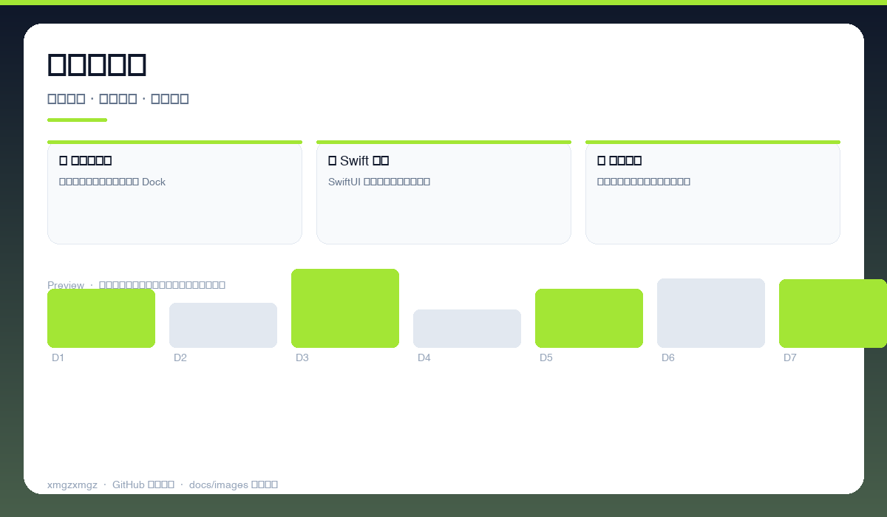
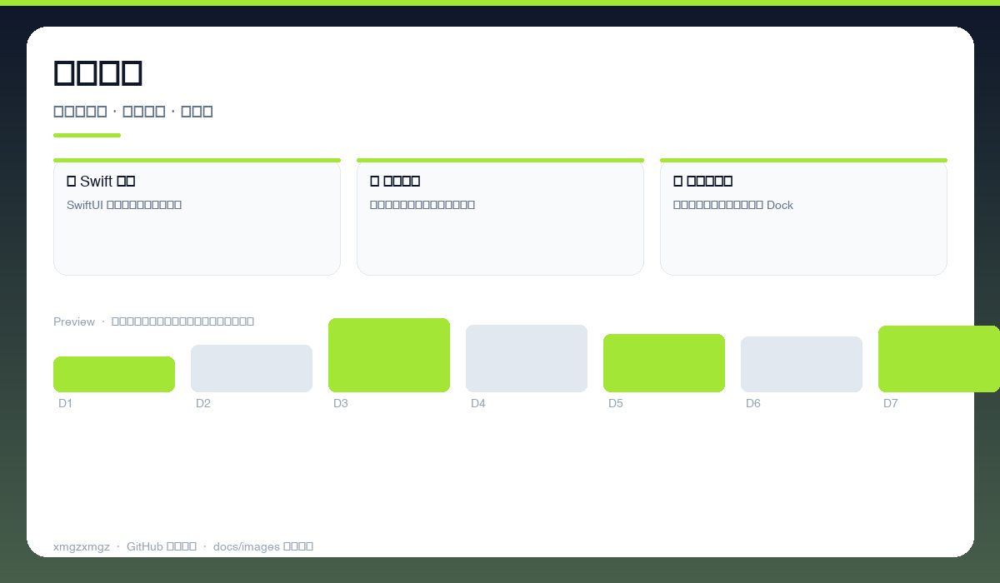
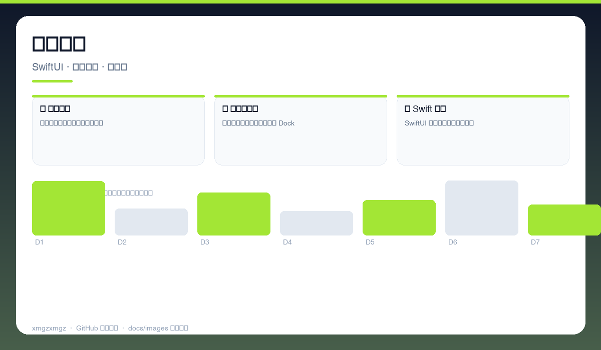

# 📝 LeaveWhite — LeaveWhite

> 常驻状态栏的极简便签 — 点一下就记，不打扰你的专注。

[](https://github.com/xmgzxmgz/LeaveWhite)
[](https://github.com/xmgzxmgz/LeaveWhite/releases)
[](LICENSE)
[](https://github.com/xmgzxmgz/LeaveWhite/actions/workflows/release.yml)

---

## ✨ 功能一览

| 模块 | 能力 | 状态 |
|------|------|------|
| 📌 状态栏常驻 | 一点即开，置顶悬浮，不占 Dock | ✅ |
| ⚡ Swift 原生 | SwiftUI 打造，启动快、占用低 | ✅ |
| 📝 轻量备忘 | 自动保存、快捷键呼出、随手贴 | ✅ |

---

## 📸 功能预览

> 以下为自动生成的示意预览（无需本地部署截图），展示核心功能形态。

| 总览 | 细节 | 流程 |
|------|------|------|
|  |  |  |
| 状态栏便签 · 一点即开 · 置顶悬浮 · 自动保存 | 快捷操作 · 快捷键呼出 · 拖拽置顶 · 多便签 | 原生体验 · SwiftUI · 深色适配 · 低占用 |

<details>
<summary>查看大图</summary>


</details>

---

## 🚀 快速开始

```bash
open LeaveWhite.xcodeproj  # Xcode 构建
# 或直接下载 Releases 里的 .dmg 拖入 /Applications
```

---

## 🛠 技术栈

Swift · SwiftUI · macOS MenuBar · AppKit

---

## 🗂️ 目录结构（节选）

```
LeaveWhite/
├── docs/images/        # 本 README 的三张自动生成预览图
├── .github/workflows/  # Auto Release 自动发版
├── README.md
└── ...                 # 源码与配置
```

---

## 📦 Releases

本仓库已启用 **Auto Release**（`.github/workflows/release.yml`）：

- 推送 `v*` tag 自动发版：`git tag v0.2.0 && git push origin v0.2.0`
- 手动触发：`gh workflow run "Auto Release" -f version=v0.2.0`（留空则自动 patch +1）
- 变更说明自动生成（`--generate-notes`）

前往 [Releases](https://github.com/xmgzxmgz/LeaveWhite/releases) 查看。

---

## 🙏 相关项目

- [workbuddy-account-hub](https://github.com/xmgzxmgz/workbuddy-account-hub) — WorkBuddy 账户中枢（本 README 的样板）
- 更多见 [xmgzxmgz 主页](https://github.com/xmgzxmgz)

---

## 许可

MIT
